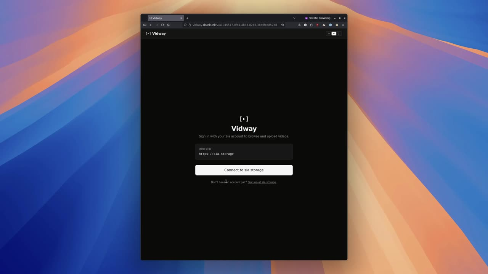

<p align="center">
  
</p>

# Vidway

> *Share videos your way with Vidway.*
>
> Your videos. Your storage. Your control.

Vidway is a video catalog. Users publish videos to Sia from their own indexer account, generate a time-limited share URL, and submit that URL plus a title, description, and thumbnail to Vidway. Anyone with a Sia account can browse the catalog and watch videos — playback streams directly from Sia hosts to the viewer's browser. Vidway's backend never touches the video bytes; it only stores the catalog row.

## Demo

<!--
  GitHub strips raw <video> tags from rendered Markdown for security, so a
  plain `<video src=...>` won't render inline on github.com. The pattern
  that does work: upload the MP4 to a GitHub issue/PR comment (or release
  asset) and replace the link below with the resulting
  `https://github.com/user-attachments/...` URL — that domain renders an
  inline player. The thumbnail-with-play-button fallback below works
  everywhere that does support relative paths (clones, VS Code,
  Codeberg, etc.) and falls through to a download on github.com.
-->

[](docs/demo.mp4)

> A 100-second walkthrough: connect to sia.storage, upload an MP4, watch it stream back from Sia hosts.

## Repo layout

```
vidway/
├── api/   # Node + Hono + SQLite catalog backend
└── web/   # React + Vite frontend
```

Both packages live in this monorepo. `web` connects to a Sia indexer at `https://sia.storage` for video storage and to `api` for the catalog.

## Prerequisites

- Node 20+
- pnpm 9+ (or npm / bun — examples below assume pnpm)
- A registered account at [sia.storage](https://sia.storage) — needed for any user, uploader or viewer

## Setup

```bash
pnpm install

# Copy and edit the env files
cp .env.example .env
cp web/.env.example web/.env       # not required for local dev
```

## Run

In two terminals:

```bash
# Terminal 1 — backend
pnpm --filter api dev
# → http://localhost:8787

# Terminal 2 — frontend
pnpm --filter web dev
# → http://localhost:5173
```

On first run, the API initializes a SQLite database at `api/data/vidway.db`.

## Run with Docker Compose

For a one-command production-like setup:

```bash
cp .env.example .env       # adjust if you want non-default ports/URLs
docker compose up --build
# → web at  http://localhost:8080
# → api at  http://localhost:8787
```

`docker compose` reads `.env` from the project root automatically, so any of `VITE_VIDWAY_API_URL`, `WEB_PUBLIC_ORIGIN`, `WEB_PORT`, `API_PORT` you set there will flow into both the build args and the container env. No extra flags needed.

The catalog SQLite file is bind-mounted to `./api/data/vidway.db` on the host, so it survives `docker compose down` and image rebuilds. Delete the file to wipe the catalog.

To deploy somewhere with a real public URL, just edit `.env`:

```env
VITE_VIDWAY_API_URL=https://api.example.com
WEB_PUBLIC_ORIGIN=https://vidway.example.com
```

Then `docker compose up --build -d`. Or pin the host ports if 8080 / 8787 collide with something else:

```env
WEB_PORT=3000
API_PORT=4000
VITE_VIDWAY_API_URL=http://localhost:4000
WEB_PUBLIC_ORIGIN=http://localhost:3000
```

Shell env still wins if you'd rather override on the command line for a one-off:

```bash
VITE_VIDWAY_API_URL=https://staging.example.com docker compose up --build
```

## Build status

This repo is **Phase 0 + Phase 1 + Phase 2 + Phase 3** from the stack overview:

✅ Workspaces wired up
✅ Hono backend with SQLite catalog
✅ Signed listing CRUD (`POST` / `GET` / `PATCH` / `DELETE /listings`)
✅ Auth flow forked from Sia starter, indexer URL locked to `sia.storage`
✅ Routing with `react-router-dom` (gated on `step === 'connected'`)
✅ Upload form with **ffmpeg.wasm** remuxing source video to fragmented MP4
✅ Real first-frame thumbnails (extracted via ffmpeg at the 1-second mark)
✅ Browse page with **search, sort, expired toggle, load-more pagination**
✅ Watch page with **MSE-based streaming player** — ranged downloads from Sia hosts feed a `SourceBuffer` chunk by chunk
✅ `/mine` page with **refresh / edit / delete** actions on each listing
✅ **Background probe worker** marking expired & dead listings every 5 min
✅ **Flag button** on the watch page → catalog table for operator review
✅ **Rate limiting** on `POST /listings` (20/h) and `POST /listings/:id/flag` (10/h)
✅ **Admin CLI** for inspecting flags and removing listings
✅ **Dark mode** with light / dark / system options, preference persisted per user account

## Demo flow

### Phase 1+2 (upload, watch, browse)

1. Start both servers (`pnpm -r --parallel dev`).
2. In **Browser A**, open http://localhost:5173. Approve the connection at sia.storage and complete onboarding with a new recovery phrase.
3. Click **Upload**. Drop an MP4 (H.264 + AAC works best). Fill in title, description, pick an expiry. The browser remuxes the file to fragmented MP4 and extracts a thumbnail before uploading to Sia.
4. Land on the watch page. The MSE player streams the video from Sia hosts in 4 MB chunks. Seeking within the buffered region works freely; seeking past it pauses until the streamer catches up.
5. Open **Browser B** (incognito or another profile). Onboard with a *different* recovery phrase.
6. The catalog should show the listing from Browser A. Click into it and watch the same video stream from Sia.

### Phase 3 (manage, search, flag, moderate)

7. Back in Browser A, head to **My Listings**. You'll see a table with thumbnails and per-row Refresh / Edit / Delete buttons. Click **Edit** to change the title or description; **Refresh** to mint a new share URL with a fresh expiry; **Delete** to remove the catalog row (the video stays on Sia by default; tick the *"Also unpin from Sia"* checkbox in the dialog to also call `sdk.deleteObject` on the same flow). For long-lived listings, pick the **Unlimited** option in the upload or refresh dialog and the share URL won't expire.
8. On the Browse page, type into the **search box** to filter by title or description (FTS5 with porter stemming). Switch the **sort dropdown** between *Newest*, *Expiring soon*, *Longest*, *Shortest*. Toggle **Show expired** to include `dead` listings in results.
9. From Browser B, click into someone else's listing and click the **⚑ Flag** button. Pick a reason, optionally add detail, submit. Submission is rate-limited to 10/hour per IP.
10. From the API workspace, run the operator CLI to review the flags:

    ```bash
    pnpm --filter api admin:list-flags                # last 7 days
    pnpm --filter api admin:list-flags -- --since 1h  # last hour
    pnpm --filter api admin:list-flags -- --reason illegal
    ```

    Once you've decided to act on something, take it down:

    ```bash
    pnpm --filter api admin:remove-listing -- <listingId>
    ```

11. The **probe worker** runs every 5 minutes in the background. It marks listings as `dead` once `valid_until` passes, and probes `alive` / `unknown` listings every hour to check the share URL is still live. Watch `pino` logs in the API terminal to see it ticking. To force an immediate "dead" state, use Refresh with the shortest expiry on a listing, then wait — or just check the watch page after expiry, which will fail the playback gracefully.

## Notes on Phase 2

- **First upload pays a one-time cost**: the ffmpeg.wasm core (~30 MB) is fetched from a CDN via `toBlobURL`. The blob URL is reused for the tab's lifetime; the browser usually caches the underlying CDN response too, so subsequent loads are fast. Internet is required on the first upload of a session.
- **`-c copy` only**: video is remuxed, not re-encoded, so the source must be in browser-friendly codecs (H.264 video, AAC audio). HEVC/VP9/AV1 sources will produce an output that won't play.
- **Sequential streaming**: the player fetches forward from byte 0 in 4 MB chunks. You can seek freely within the buffered region but seeking past it waits for the streamer to catch up. Real seek-anywhere needs fMP4 box parsing (e.g. `mp4box.js`) and is deferred to a future phase.

## Notes on Phase 3

- **Probe cadence**: every 5 minutes the worker runs three steps in this order — (1) flip anything past `valid_until` to `dead`; (2) probe up to 8 stale `alive`/`unknown` listings via `HEAD` (falling back to `GET` with `Range: bytes=0-0` on 405/501); (3) prune `used_nonces` rows older than 24 hours. Network errors leave probe state unchanged for retry on the next tick.
- **Rate limits are in-memory token buckets** keyed on the client IP from `X-Forwarded-For` / `X-Real-IP`. They reset when the API restarts. Good enough for a hackathon — swap in Redis if you ever ship this.
- **Refresh re-shares the same Object ID.** The server enforces this — passing a share URL that points at a different Object ID gets rejected with `object_id_changed`. So a refresh can't be used to silently swap one video for another.
- **Expiry options include "Unlimited".** Picking it sets the share URL's `validUntil` to year 9999. The probe worker's TTL check (`valid_until <= now`) won't fire on it, the badge displays as **No expiry** in green, and the listing stays alive until the uploader explicitly deletes it. The API caps anything past year 9999 with `too_far` to catch overflow / bogus inputs.
- **Delete is catalog-only by default.** Removing a listing drops the catalog row but the video bytes stay on Sia under the uploader's indexer account. The delete dialog has an optional **"Also unpin from Sia"** checkbox that calls `sdk.deleteObject(objectId)` after the catalog delete succeeds, which removes the object from the uploader's indexer state as well. (The underlying host shards may persist until contracts expire — that's outside the SDK's scope.)
- **Dark mode** is class-based (Tailwind v4 `@custom-variant`), with a Light / System / Dark toggle in the navbar. Pre-auth, the page follows the OS `prefers-color-scheme`. Once the user authenticates, their preference is loaded from `localStorage` keyed on a 16-char prefix of their pubkey — so two users sharing the same browser get their own theme back. Picking *System* re-attaches the OS preference; the page also reacts live if the OS theme flips while the page is open.
- **Flags don't auto-takedown.** They go in the `flags` table for an operator to review with the admin CLI. No automated content scanning, no DMCA pipeline. If you ship past a hackathon, that's where you'd add it.

## Architecture summary

- **No anonymous viewers.** Every Vidway user authenticates against `https://sia.storage`. The viewer's own SDK is what downloads ranged shards from Sia hosts during playback.
- **Authentication is via App Key signatures.** No passwords, no sessions. Every write to the catalog is signed by the user's ed25519 App Key; the public key is stored on the row as proof of ownership.
- **The site never stores video bytes.** It stores the share URL string, the public key, and presentation metadata (title, description, duration, thumbnail).
- **Expiry is enforced by Sia, not Vidway.** When a share URL expires, the listing 404s on play. Vidway marks dead listings in a background probe (Phase 3).

See `vidway-stack-overview.md` (sibling document) for the full spec.

## License

MIT
